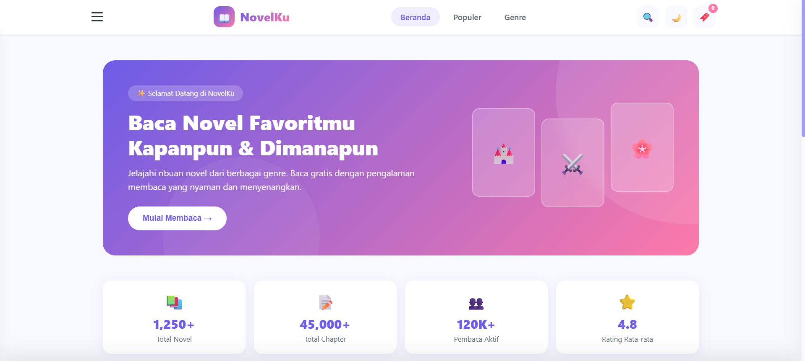
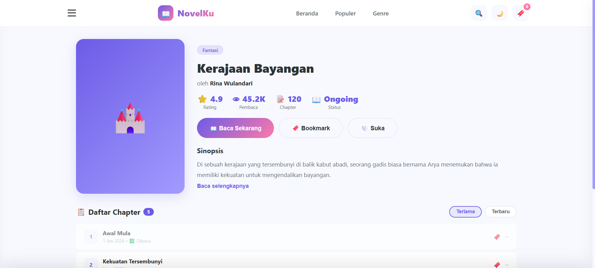

# 📖 NovelKu - Platform Baca Novel Online

<div align="center">


**Platform baca novel online dengan UI/UX modern dan fitur lengkap**

[Fitur](#-fitur) • [Demo](#-demo) • [Instalasi](#-instalasi) • [Teknologi](#-teknologi)

</div>

---

## 📋 Tentang Project

**NovelKu** adalah aplikasi web untuk membaca novel online yang dikembangkan dengan HTML, CSS, dan JavaScript murni (vanilla). Project ini dirancang dengan antarmuka yang modern, responsif, dan user-friendly untuk memberikan pengalaman membaca yang nyaman.

Project ini dibuat untuk memenuhi tugas **UTS (Ujian Tengah Semester)** mata kuliah **Web Programming**.

**Anggota Kelompok:**
1. 2408107010079 - Roseline Balqist
2. 2408107010080 - Lutfi Bintang Andrianto
3. 2408107010096 - Muhammad Shidqi Hanif
4. 2408107010104 - Muhammad Sulthan Shadiq
5. 2408107010114 - Ahmad Hanif

### ✨ Keunggulan
- 🎨 **Desain Modern** - UI/UX yang clean dan menarik
- 📱 **Responsive** - Bisa diakses di desktop, tablet, dan mobile
- 🌙 **Dark Mode** - Mode gelap untuk kenyamanan mata
- ⚡ **Fast Loading** - Tanpa framework, loading super cepat
- 💾 **Local Storage** - Data bookmark dan favorit tersimpan di browser

---

## 🚀 Fitur Utama

### 📚 Manajemen Novel
- ✅ Katalog novel dengan berbagai genre (Fantasi, Action, Romance, Mystery, Sci-Fi)
- ✅ Sistem pencarian novel real-time
- ✅ Filter berdasarkan kategori dan popularitas
- ✅ Detail novel lengkap dengan sinopsis

### 📖 Reader Experience
- ✅ Pembaca novel dengan navigasi chapter
- ✅ Progress bar membaca otomatis
- ✅ Pengaturan font (ukuran, jenis, tema)
- ✅ 3 Tema baca: Terang, Sepia, Gelap
- ✅ Navigasi chapter sebelumnya/selanjutnya

### 🔖 Interaksi User
- ✅ Sistem bookmark untuk menyimpan novel favorit
- ✅ Like/favorite novel
- ✅ Komentar pada setiap chapter
- ✅ Like komentar user lain
- ✅ Riwayat chapter yang sudah dibaca

### 🎯 Navigasi
- ✅ Sidebar menu dengan animasi smooth
- ✅ Tombol kembali kontekstual (smart back navigation)
- ✅ Breadcrumb navigation
- ✅ Keyboard shortcuts (ESC untuk tutup, Ctrl+K untuk search)

### 🎨 Customization
- ✅ Dark/Light mode toggle
- ✅ Multiple font families (Serif, Sans, Mono)
- ✅ Adjustable font size (14px - 28px)
- ✅ Reading theme customization

---

## 📸 Screenshots

### 🏠 Halaman Beranda


### 📖 Halaman Reader


---

## 🛠️ Teknologi yang Digunakan

### Frontend
- **HTML5** - Struktur halaman semantik
- **CSS3** - Styling dengan CSS Variables & Flexbox/Grid
- **JavaScript (ES6+)** - Logika aplikasi interaktif

### Fitur Browser
- **LocalStorage API** - Penyimpanan data client-side
- **CSS Custom Properties** - Theming dinamis
- **CSS Animations** - Transisi dan efek visual

### Tools
- **Visual Studio Code** - Code editor
- **Git & GitHub** - Version control
- **Chrome DevTools** - Debugging & testing

---

## 📦 Instalasi & Penggunaan

### Clone Repository 

```bash
# Clone repository ini
git clone https://github.com/MuhammadShidqiHanifUSK/UTS_MK_PBW_A_KLP2.git

# Masuk ke folder project
cd novelku

# Buka file index.html di browser
# Bisa double-click atau gunakan Live Server
